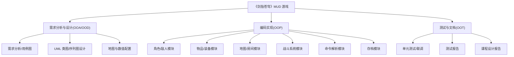
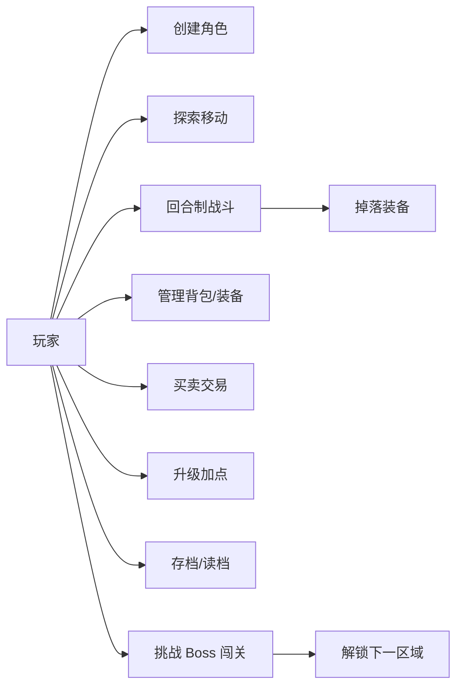
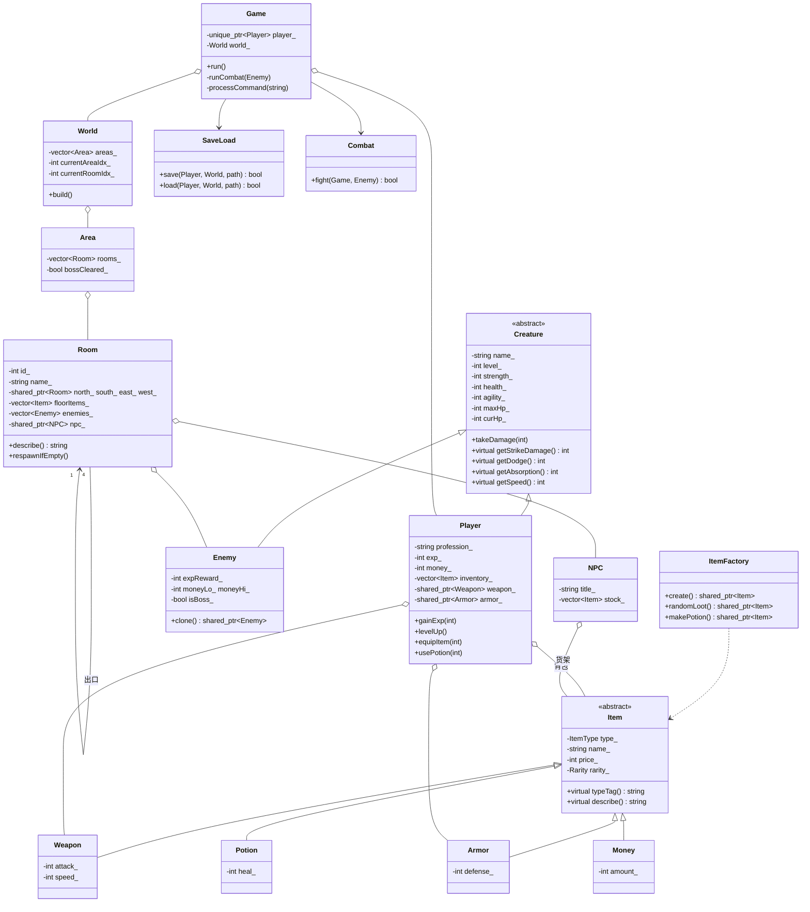
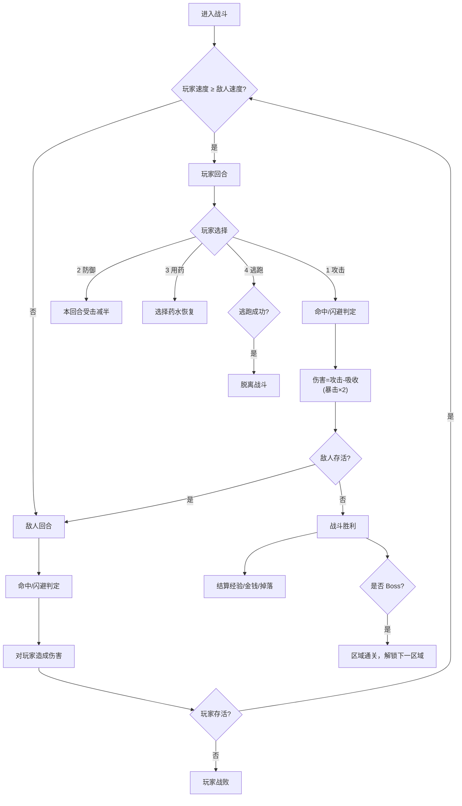
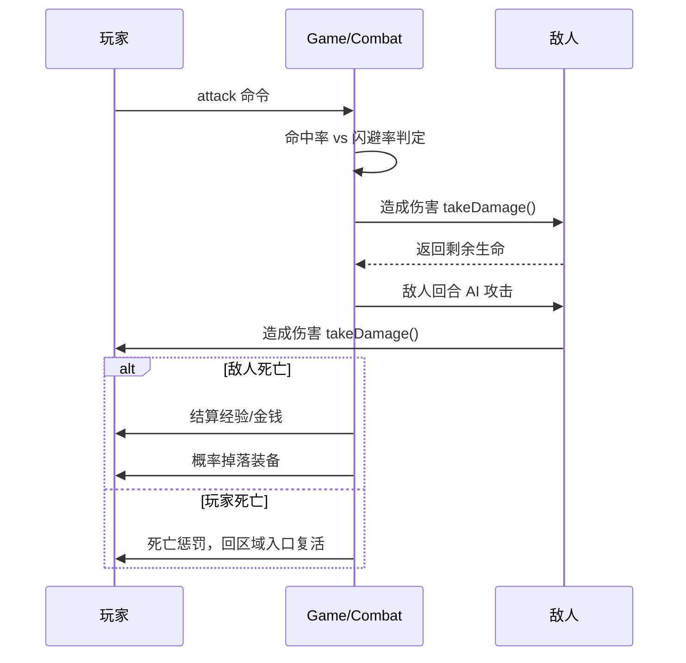

# 《剑指苍穹》单机版文字 MUD 游戏 · 课程设计文档

> 程序设计基础实践 —— 面向对象软件开发（OOA / OOD / OOP / OOT）
> 开发语言：C++17 　|　 运行环境：Linux 控制台 　|　 编译方式：`make`

---

## 1. 项目概述

### 1.1 选题说明

本项目依照《程序设计基础实践》实验大纲要求，设计并实现一款**单机版文字 MUD（Multiple User Domain）游戏**。游戏采用经典的"以房间为单元"的地图与文字字符界面，玩家通过输入命令进行探索、战斗、养成与闯关。

### 1.2 故事背景

> 江湖动荡，群魔乱舞。魔教教主图谋不轨，祸乱武林。你，一位初出茅庐的少侠，将从**新手村**出发，历经**迷雾森林、黑风寨、幽暗古墓**，最终攻入**魔教总坛**，击败教主，还天下太平。江湖之上，快意恩仇；宝剑在手，谁与争锋！

游戏思想内容健康向上、表现正能量，抵制消极因素，符合大纲要求 [1]。

### 1.3 游戏特色

| 特色 | 说明 |
|---|---|
| 角色创建 | 自定义姓名，选择职业（剑客 / 刺客 / 道士），三职业属性倾向不同 |
| 回合制战斗 | 攻击、防御、用药、逃跑四选一，含命中率、闪避率、暴击、伤害吸收计算 |
| 关卡闯关 | 五大区域（关卡），每关有普通敌人与 Boss，击败 Boss 解锁下一区域 |
| 装备掉落 | 击败敌人随机掉落武器 / 盔甲，品质分普通 / 精良 / 稀有 / 传说 |
| 角色养成 | 打怪获得经验与金钱，升级加点（力量 / 健康 / 敏捷） |
| 商店系统 | 药铺、铁匠铺 NPC，支持购买与出售 |
| 存档读档 | 完整保存玩家状态、背包、装备、位置与关卡进度 |
| 彩色界面 | ANSI 彩色字符界面，中 / 英文双命令 |

### 1.4 开发流程

遵循教材第一章面向对象软件开发技术：**OOA 分析 → OOD 设计 → OOP 编码 → OOT 测试**，详细过程见后文。

---

## 2. 需求分析（OOA）

### 2.1 功能需求

1. **角色系统**：创建角色（姓名 + 职业）；核心属性力量 / 健康 / 敏捷；派生属性生命 MHP/CHP、命中、闪避、攻击伤害、伤害吸收；经验、等级、金钱；升级获得自由属性点可手动加点。
2. **物品与装备系统**：物品类型（武器、盔甲、药水、金钱）；物品品质（普通 / 精良 / 稀有 / 传说）；背包（STL 容器）；当前武器槽、盔甲槽；穿戴 / 卸下 / 使用 / 丢弃。
3. **地图系统**：以房间为单元，房间含出口、物品、敌人、NPC；区域（关卡）对房间分组；区域间通过 Boss 通关解锁。
4. **战斗系统**：玩家与敌人回合制交手；命中 / 闪避 / 伤害 / 暴击 / 防御计算；击杀获得经验金钱；概率掉落装备；Boss 必掉且通关。
5. **商店系统**：药铺与铁匠铺 NPC，提供货架，支持购买与半价出售。
6. **命令系统**：支持中文与英文命令（移动、查看、背包、装备、战斗、交易、存档等）。
7. **存档系统**：保存 / 读取游戏进度到 `save.dat` 文件，支持重新开始。
8. **其他**：彩色字符界面、死亡惩罚与复活、怪物刷新刷装备。

### 2.2 WBS 工作分解结构图



### 2.3 Use-Case 用例图



---

## 3. 系统设计（OOD）

### 3.1 模块划分

| 模块 | 文件 | 职责 |
|---|---|---|
| 公共定义 | `types.h` | 颜色、工具函数、枚举、前向声明 |
| 物品系统 | `item.h/.cpp` | 物品基类、派生类、工厂 |
| 生物系统 | `creature.h/.cpp` | 生物基类、玩家、敌人、NPC |
| 地图系统 | `room.h/.cpp` `world.h/.cpp` | 房间、区域、世界地图 |
| 游戏引擎 | `game.h/.cpp` | 战斗、存档、命令解析、主循环 |
| 入口 | `main.cpp` | 程序入口 |

### 3.2 UML 类图



### 3.3 核心算法 —— 回合制战斗流程图



### 3.4 战斗核心序列图



---

## 4. 关键实现（OOP）

### 4.1 面向对象特性运用

| 特性 | 应用 |
|---|---|
| 抽象基类 + 多态 | `Item` 抽象基类派生 `Weapon/Armor/Potion/Money`；`Creature` 基类派生 `Player/Enemy`，虚函数 `getStrikeDamage()`、`describe()` 等 |
| 封装 | 属性均为私有，通过 getter/setter 访问；战斗、存档逻辑封装为独立类 |
| 继承 | 类层次清晰，公共属性与行为上移到基类 |
| 组合 | `Game` 聚合 `Player` 与 `World`；`Player` 持有 `shared_ptr<Weapon/Armor>` 与背包容器 |
| 虚析构 | 基类定义虚析构，保证多态删除安全 |

### 4.2 STL 标准模板库应用

| STL 组件 | 应用场景 |
|---|---|
| `std::vector<shared_ptr<Item>>` | 玩家背包、NPC 货架、房间敌人与物品列表 |
| `std::vector<shared_ptr<Area/Room>>` | 世界地图区域、区域房间集合 |
| `std::map<string, string>` | 存档解析的键值对存储 |
| `std::unique_ptr<Player>` | 游戏引擎持有玩家对象（所有权唯一） |
| `std::shared_ptr` | 物品、敌人、房间等共享所有权，简化内存管理 |
| `std::string` | 文本处理、命令解析 |
| `std::random_device / mt19937 / uniform_int_distribution` | 随机掉落、命中判定、暴击 |
| `std::transform / find / remove_if / sort` | 字符串小写化、移除死亡敌人、物品处理 |
| 迭代器 | 遍历背包、房间、区域等容器 |

### 4.3 设计模式

| 模式 | 应用 |
|---|---|
| **工厂模式** | `ItemFactory::create()` 按类型标识生成具体物品对象，`randomLoot()` 按等级与品质生成战利品，客户端不感知具体类 |
| **模板方法模式** | `Creature` 定义伤害结算骨架，`getStrikeDamage()` / `getDodge()` 等为钩子函数，`Player` 覆写以叠加装备加成 |
| **命令分发** | 命令解析统一入口，按命令词分发到对应处理函数（map + if-else 结构），便于扩展新命令 |
| **单例式上下文** | `Game` 聚合玩家与世界，作为游戏运行的唯一上下文 |

---

## 5. 存档设计

存档文件 `save.dat` 采用自定义文本格式（`key=value` 行 + 分号分隔的物品序列），包含：

- 玩家成长状态：姓名、职业、等级、经验、金钱、属性点、三项核心属性、当前生命
- 地图进度：当前区域、当前房间、各区域通关标志
- 背包与装备：序列化物品（`类型|名称|价格|品质|数值1|数值2`）

```text
MUDSAVE|1
name=测试侠
profession=剑客
level=8
...
area=1
room=0
cleared=1,0,0,0,0
inv=P|金疮药|15|0|60|0;A|锁子甲|76|0|19|0
weapon=W|青锋剑|120|1|12|1
armor=A|皮甲|80|1|7|0
```

读档时解析键值，重建玩家对象并恢复状态；已通关区域的 Boss 不会再次出现。

---

## 6. 遇到的问题及解决方案

| 问题 | 解决方案 |
|---|---|
| 多态对象无法直接序列化存档 | 为物品定义 `typeTag()` 虚函数，按类型输出数值字段，读档时由 `ItemFactory` 重建 |
| 读档后升级经验需求不一致 | 统一经验公式 `expToLevel = 100 + (level-1)*60`，创建 / 升级 / 读档共用 |
| 怪物清空后房间无怪可刷 | 房间保存初始敌人模板，`respawnIfEmpty()` 非 Boss 房间自动刷新，支撑刷装备玩法 |
| 新手初期直接闯关易死亡 | 设计休息恢复、药铺补给、升级加点、练级刷怪等多条成长路径，死亡仅损失 20% 金钱并回区域入口复活 |
| 中文命令与英文命令并存 | 命令解析先统一转小写，中文与英文别名映射到同一处理函数 |
| Windows / Linux 跨平台编译 | 仅使用标准 C++17 与 ANSI 转义色码，Linux g++ 直接编译通过 |
| 战斗中逃跑被误判为击杀 | `runCombat` 原仅区分「玩家死亡 / 玩家胜利」，逃跑成功跳出循环后仍走胜利结算。增加 `fled` 逃跑标记：逃跑成功立即结束战斗并跳过击杀结算，敌人保留当前血量，回到房间后仍可再战 |

---

## 7. 测试方案与结果

### 7.1 测试方法

采用黑盒 + 白盒结合的自动化冒烟测试（Python 驱动子进程，模拟玩家输入）：

| 用例 | 覆盖点 | 结果 |
|---|---|---|
| 创建角色 → 查看背包 | 主菜单、角色创建、初始装备 | ✅ 通过 |
| 移动 → 遇敌 → 回合制战斗 | 房间移动、命中/闪避/暴击/伤害 | ✅ 通过 |
| 击败敌人 → 掉落装备 | 经验/金钱结算、概率掉落入库 | ✅ 通过 |
| 商店购买 / 出售 / 使用药水 | 交易系统、背包管理 | ✅ 通过 |
| 升级加点 | 经验增长、属性点分配 | ✅ 通过 |
| 存档 → 读档 | 玩家状态、背包、装备、位置、通关进度恢复 | ✅ 通过 |
| 击败 Boss → 通关 → 下一区域 | 关卡解锁、区域推进 | ✅ 通过 |
| 战斗中逃跑 | 逃跑成功脱离战斗，不触发经验 / 金钱 / 掉落结算，敌人保留血量可再战 | ✅ 通过 |
| 玩家战败 | 死亡惩罚、区域入口复活、怪物刷新 | ✅ 通过 |

> 说明：以上测试在 Windows 本地使用 MinGW g++ 编译验证；游戏代码为纯标准 C++17，在 Linux 虚拟机 `make` 即可编译运行。

### 7.2 编译命令（Linux 虚拟机）

```bash
make          # 编译，生成可执行文件 mud
make run      # 编译并运行
make clean    # 清理
```

### 7.3 快速上手

```text
1. 开始新游戏 → 输入姓名 → 选择职业（1 剑客 / 2 刺客 / 3 道士）
2. 新手村：西去铁匠铺买装备、北侧药铺买药水（list / buy <编号>）
3. 东去练武场，attack 攻击野狗练级；打不过用 rest 休息、use 药水
4. 击败各房间敌人后，挑战 Boss（★），通关后输入 next 进入下一区域
5. 随时 save 存档；quit 退出后可从主菜单读取存档
```

### 7.4 常用命令速查

| 功能 | 命令（英文 / 中文） |
|---|---|
| 移动 | north/n/south/s/east/e/west/w（北/南/东/西） |
| 查看 | look/l（查看） |
| 状态 | status/st（状态）、who（玩家） |
| 背包 | inventory/i（背包） |
| 装备 | equip <编号>（装备）、unequip weapon/armor（卸下） |
| 使用 | use <编号>（使用）、drop <编号>（丢弃）、pick（拾取） |
| 战斗 | attack <编号>（攻击）、defend（防御）、flee（逃跑） |
| 交易 | list（商店）、buy <编号>（购买）、sell <编号>（出售） |
| 成长 | train 力量/健康/敏捷（加点）、rest（休息） |
| 存档 | save（存档）、next（下一区域）、help（帮助）、quit/q（退出） |

---

## 8. 小组成员分工（示例模板）

| 成员 | 分工模块 | 职责 |
|---|---|---|
| 组长：XXX | 需求分析 / 系统设计 | WBS、用例图、UML 类图、整体架构 |
| 组员：XXX | 角色 / 敌人模块 | `creature.h/.cpp`、属性与成长、敌人 AI |
| 组员：XXX | 物品 / 装备模块 | `item.h/.cpp`、掉落与工厂、背包 |
| 组员：XXX | 地图 / 房间模块 | `room.h/.cpp`、`world.h/.cpp`、关卡配置 |
| 组员：XXX | 战斗 / 命令 / 存档模块 | `game.h/.cpp`、回合制战斗、存档读写 |

---

## 9. 总结

本课程设计以面向对象软件工程方法为指导，完整走过了需求分析、系统设计、编码实现与测试的全过程。游戏实现了大纲要求的单机版 MUD 核心功能：角色创建与养成、回合制战斗、装备掉落与强化、房间地图与关卡闯关、NPC 商店、彩色字符界面、存档读档，并充分运用了 STL 容器 / 算法 / 迭代器与工厂、模板方法等设计模式，代码结构清晰、可扩展性强。通过自动化测试验证了功能完整性，达到了课程设计的全部要求。
